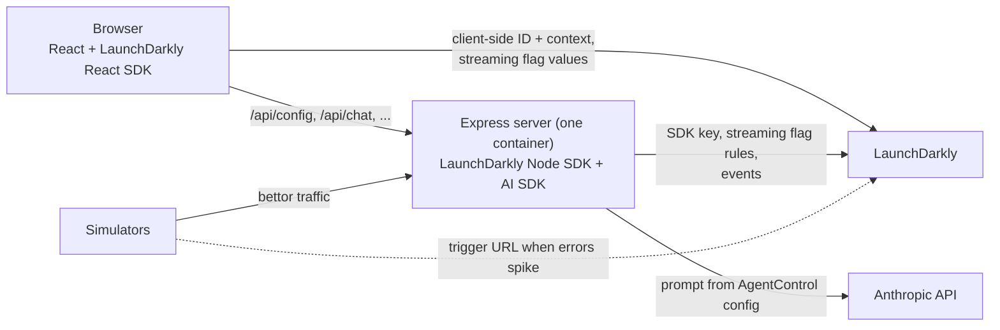

# Kickoff Sportsbook: a LaunchDarkly demo

You're launching live betting right before the Super Bowl, and your biggest risk isn't the code, it's the release. This sample app shows how LaunchDarkly separates the two: deploy whenever you're ready, then test in production with QA, release state by state, roll back in seconds (automatically when errors spike), and let experiments show what works.

Stack: React (LaunchDarkly React SDK) + Node/Express (LaunchDarkly Node server SDK and AI SDK), packaged as one Docker container.

## What's in the demo

| Prompt requirement | LaunchDarkly feature | Where it lives | How to see it |
| --- | --- | --- | --- |
| **Part 1:** flag a new feature, release and roll back | Flag `live-betting` | `client/src/App.jsx` (`useBoolVariation`), `server/src/index.js` (`/api/live/odds`) | Toggle `live-betting` and watch the LIVE panel appear and disappear |
| **Part 1:** test in production before release | Individual target (`qa-tester`) | LaunchDarkly targeting | Only the QA persona sees live betting while customers don't |
| **Part 1:** instant switch with no page reload | Streaming + explicit listener | `client/src/App.jsx` (`ldClient.on("change:live-betting")`) | A toast appears the moment the flag changes |
| **Part 1:** remediate with a trigger | Flag trigger (turn off) | `make fire-trigger`, `simulator/index.js` | Fire it with curl, or let `make simulate-outage` fire it when errors spike |
| **Part 2:** flag a landing page component | Flag `new-bet-slip` | `client/src/BetSlip.jsx` | Classic slip vs new slip (quick stakes, payout preview) |
| **Part 2:** context with custom attributes | User contexts | `server/personas.js`, `client/src/main.jsx` | `state`, `tier`, `accountAgeDays`, `isInternal` (`name` is private) |
| **Part 2:** individual and rule-based targeting | Target + rule | LaunchDarkly targeting on `new-bet-slip` | Switch personas: QA and NJ/NV get the new slip, CA gets the classic one |
| **Extra credit:** experiment on the Part 2 flag | Metric `bet-placed`, experiment | `client/src/App.jsx` (`track`), `server/src/index.js` (`/api/bets`), `simulator/bets.js` | `make simulate-bets`, then read the experiment results |
| **Extra credit:** AI Configs | AgentControl config `bet-assistant` | `server/src/chat.js`, `client/src/ChatWidget.jsx` | Ask the bet assistant; change the prompt in LaunchDarkly with no deploy |
| **Extra credit:** integrations | GitHub code references, Slack | `.github/workflows/ld-code-refs.yml` | Flag pages show code references; Slack posts flag changes |

## Where the LaunchDarkly code is

All LaunchDarkly code is in the files below; links go to the exact lines. Search the repo for these comments to find the places you'd change for your own project: `// SDK KEY:` (where the SDK key comes from), `// FLAG:` (every flag key, which must exist in your project), and `// AI CONFIG:` (the AgentControl config key).

**Server SDK** (Node, [server/src/index.js](server/src/index.js))

| What | Where |
| --- | --- |
| SDK key from `.env` | [index.js#L21](server/src/index.js#L21) |
| Create the client (one per process, offline mode without a key) | [index.js#L31](server/src/index.js#L31) |
| Wait for initialization before serving | [index.js#L158](server/src/index.js#L158) |
| Report SDK status in `/healthz` | [index.js#L43](server/src/index.js#L43) |
| Evaluate `live-betting` per request, with the caller's context | [index.js#L89](server/src/index.js#L89) |
| Evaluate `new-bet-slip` (experiment exposure for simulated bettors) | [index.js#L117](server/src/index.js#L117) |
| `track("bet-placed")` with a context (experiment conversion) | [index.js#L131](server/src/index.js#L131) |
| Flush events and close on shutdown | [index.js#L173](server/src/index.js#L173) |

**Browser SDK** (React)

| What | Where |
| --- | --- |
| Start the SDK with the client-side ID and initial context | [client/src/main.jsx#L67](client/src/main.jsx#L67) |
| Evaluate `live-betting` and `new-bet-slip` with hooks | [client/src/App.jsx#L20](client/src/App.jsx#L20) |
| Wait for initialization (no flicker) | [client/src/App.jsx#L28](client/src/App.jsx#L28) |
| Explicit change listener for `live-betting` (Part 1) | [client/src/App.jsx#L57](client/src/App.jsx#L57) |
| `identify()` when the persona changes (Part 2) | [client/src/App.jsx#L103](client/src/App.jsx#L103) |
| `track("bet-placed")` when a bet is placed (experiment) | [client/src/App.jsx#L122](client/src/App.jsx#L122) |
| Values with evaluation reasons (presenter panel) | [client/src/Presenter.jsx#L30](client/src/Presenter.jsx#L30) |

**Contexts:** the demo personas and simulated bettors, with custom attributes and `name` marked private, are in [server/personas.js](server/personas.js).

**AI Config** (AgentControl, [server/src/chat.js](server/src/chat.js))

| What | Where |
| --- | --- |
| Config key | [chat.js#L5](server/src/chat.js#L5) |
| AI client on top of the server SDK client | [chat.js#L47](server/src/chat.js#L47) |
| Get the config for the bettor, with a fallback | [chat.js#L61](server/src/chat.js#L61) |
| Tracker: duration, tokens, success and error | [chat.js#L75](server/src/chat.js#L75) |
| Thumbs up/down feedback | [chat.js#L109](server/src/chat.js#L109) |

**Triggers, REST API, and CI**

| What | Where |
| --- | --- |
| `make fire-trigger` | [Makefile](Makefile) (target `fire-trigger`) |
| Automatic remediation: fire the trigger when errors spike | [simulator/index.js#L31](simulator/index.js#L31) |
| REST API helper (semantic patch) | [scripts/lib/ld.js](scripts/lib/ld.js) |
| Create all resources | [scripts/bootstrap.js](scripts/bootstrap.js) |
| Restore the demo state | [scripts/demo-reset.js](scripts/demo-reset.js) |
| Pre-flight checks | [scripts/doctor.js](scripts/doctor.js) |
| Code references workflow | [.github/workflows/ld-code-refs.yml](.github/workflows/ld-code-refs.yml) |

## Prerequisites and assumptions

- **Docker** with Docker Compose v2 (Docker Desktop on macOS or Windows, or Docker Engine on Linux). This is the only runtime you need: the app, scripts, and simulators all run in containers.
- **make** and **git** (preinstalled on macOS and most Linux distributions; on Windows, use WSL 2).
- A **LaunchDarkly account**. A free trial works. Guarded rollouts and some features need paid plans; nothing below requires them.
- Optional: an **Anthropic API key** for the bet assistant chatbot. Without it, the chatbot says it isn't set up and everything else works.
- Optional: **Node.js 24** if you want the hot-reload dev loop (`make dev`). The repo pins it in `.node-version`.
- Ports **3000** (app) and, for `make dev`, **5173** must be free.
- The demo uses the **Production** environment of one LaunchDarkly project (see [Environments](#environments)).

## Setup

> [!IMPORTANT]
> Everything in this demo happens in the **Production** environment of your LaunchDarkly project: the setup scripts, the keys in `.env`, and every flag change you make during the demo. In the LaunchDarkly UI, check the environment selector shows **Production** before changing anything.

### 1. Clone the repo

```bash
git clone https://github.com/alecs396/ld-sportsbook-demo.git
cd ld-sportsbook-demo
```

### 2. Create a LaunchDarkly API access token

You only need a LaunchDarkly account (a free trial works). **You don't need to create a project**: the next step creates one called `ld-sportsbook-demo` with everything the demo uses.

1. Sign in to LaunchDarkly.
2. Click the **gear icon** (Organization settings) in the left sidebar, then **Authorization**.
3. Click **Create token**.
4. **Name:** anything, for example `sportsbook-demo`. **Role:** **Writer** (enough to create the project, flags, and targeting).
5. Click **Save token** and **copy it now**: LaunchDarkly shows it only once. It starts with `api-`.

Each reviewer uses their own LaunchDarkly account: the demo is about changing flags and targeting yourself, and SDK keys are secrets that can't be shared.

### 3. Run setup and paste your token

```bash
make setup
```

This creates `.env`, asks you to paste the API token (input is hidden, so it's never shown or saved in your shell history), optionally asks for an Anthropic API key for the bet assistant (press Enter to skip), and then runs `make bootstrap`.

Bootstrap uses the token to create the project (set `LD_PROJECT_KEY` in `.env` first to use another key), both flags, the metric, the AgentControl config, and the trigger, then sets the demo's starting targeting. It also fills in the rest of `.env` for you, without printing any values:

- `LD_SDK_KEY`: the **SDK key** for Production (secret, server only)
- `LD_CLIENT_SIDE_ID`: the **client-side ID** for Production (public, used by the browser)
- `LD_TRIGGER_URL`: the trigger's secret URL, which LaunchDarkly only shows once

It never overwrites a value you've already set, and both `make setup` and `make bootstrap` are safe to run again. Prefer to edit `.env` yourself? Copy `.env.example` to `.env`, fill in `LD_API_TOKEN`, and run `make bootstrap`. Want to see exactly what it creates, or click through it yourself? See [LaunchDarkly resources](#launchdarkly-resources).

### 4. Optional: the bet assistant

If you skipped it during setup, run `make setup` again (press Enter to keep your token) or add `ANTHROPIC_API_KEY` to `.env`. Without it, the chatbot says it isn't set up and everything else works.

### 5. Check your setup

```bash
make doctor
```

This checks your keys, token, and every LaunchDarkly resource, and tells you what to fix. The first time you run it without Node installed, Docker builds the app image first, which takes about a minute. One warning is expected at this point: "App is not running", because you start it in the next step.

### 6. Start the app

```bash
make up
```

This builds and starts the app in Docker. When it prints `App: http://localhost:3000`, it's ready.

### 7. Open it in your browser

| Page | Link | What it's for |
| --- | --- | --- |
| **Sportsbook** | <http://localhost:3000> | The customer site, signed in as Cody (NJ) |
| **Presenter panel** | <http://localhost:3000/presenter> | One-click personas and live flag values with the reason for each |
| **Sportsbook as QA** | <http://localhost:3000/?as=qa-tester> | The QA tester's view (Peter), for testing in production |

Always use `localhost` in your browser. (If `make doctor` mentions `http://app:3000`, that's the address containers use to reach each other inside Docker; it doesn't work in a browser.)

You can also open the sportsbook as any persona with `?as=`: `new-jersey-user`, `nevada-vip`, `california-user`, or `qa-tester`. The persona you pick last is remembered in that browser.

To stop the app, run `make down`. To follow its logs, run `make logs`.

### 8. Optional: Slack notifications

Post every flag change (including trigger-driven rollbacks) to a Slack channel. You need a Slack workspace where you can install apps; a free one works.

1. Install the **LaunchDarkly** app from the Slack App Directory: <https://slack.com/apps/AKEEF9DTM-launchdarkly>
2. Create a channel, for example `#sportsbook-releases`.
3. In that channel, connect your LaunchDarkly account:

   ```
   /launchdarkly account
   ```

   Click **Connect with LaunchDarkly**, then **Authorize**. The first person to connect needs a LaunchDarkly role that can create webhooks (Writer or above).
4. Subscribe the channel to the project's Production flag changes (use your project key if you changed it):

   ```
   /launchdarkly subscribe -p ld-sportsbook-demo -e production
   ```

5. Check it: `/launchdarkly list` shows the subscription. Turning any flag on or off now posts to the channel.

The Slack app acts as the LaunchDarkly member who connected it and never has more permissions than that member's role.

## Running the demo

Before each run-through, restore the starting state:

```bash
make demo-reset
```

Then open three windows side by side:

1. **Customer:** <http://localhost:3000/?as=new-jersey-user>
2. **QA tester:** <http://localhost:3000/?as=qa-tester>
3. **Presenter panel:** <http://localhost:3000/presenter> (clicking a persona here also switches the customer window)

Keep LaunchDarkly open in a fourth window.

> [!IMPORTANT]
> **Stay in the Production environment for the whole demo.** The app uses Production's keys, so it only reacts to changes made in Production. If you change a flag while the LaunchDarkly UI is showing Test (or any other environment), nothing changes in the app. Check the environment selector says **Production** before every change.

### Part 1: release and remediate (`live-betting`)

_In LaunchDarkly, make sure you're in the **Production** environment._


1. **Ship dark.** `live-betting` targeting is off: everyone sees "Live betting is coming soon."
2. **Test in production.** Turn targeting **on**. `qa-tester` (Peter) is individually targeted, so only QA sees the LIVE panel. Customers still see the teaser.
3. **Release.** Change the default rule to serve **true**. Every customer's page switches to the LIVE panel with no reload, and a toast from the explicit change listener announces it.
4. **Roll back.** Turn targeting **off**. The panel disappears for everyone, instantly, with no deploy.
5. **Remediate with the trigger.** With live betting on, fire the trigger:

   ```bash
   make fire-trigger
   ```

   or with curl directly (reads the secret URL from `.env` without printing it):

   ```bash
   curl -X POST -H "Content-Type: application/json" -d '{"eventName":"Manual remediation"}' "$(grep '^LD_TRIGGER_URL=' .env | cut -d= -f2-)"
   ```

6. **Automatic remediation.** Release live betting to everyone again, then run:

   ```bash
   make simulate-outage
   ```

   Simulated bettors hit the live odds API while a demo "bug" makes it fail. The simulator acts as a monitoring tool: when the error rate crosses 20%, it fires the trigger, the flag turns off, and the errors stop. Press Ctrl+C to stop (outage mode turns off automatically).

### Part 2: targeting (`new-bet-slip`)

_In LaunchDarkly, make sure you're in the **Production** environment._


Switch personas with the dropdown in the header or the presenter panel. Each switch calls `identify()`, so flags re-evaluate with no reload.

| Persona | Context | Bet slip | Why |
| --- | --- | --- | --- |
| Peter | NV, vip, internal QA | New | Individual target (`qa-tester`) |
| Cody | NJ, standard | New | Rule "Legal live-betting states" (`state` is one of NJ, NV) |
| Maya | NV, vip | New | Same rule |
| Sam | CA, standard | Classic | No match, default rule |

The presenter panel shows the evaluation reason for each value (Individual target, Rule 1, Default rule).

### Extra credit: experiment

_In LaunchDarkly, make sure you're in the **Production** environment._


The experiment "New bet slip vs classic" runs on the **Legal live-betting states** rule of `new-bet-slip`, with the `bet-placed` metric. Both slips send `track("bet-placed")` from the same function, so only the design differs.

1. **Start it.** `make bootstrap` already created the experiment (flag `new-bet-slip`, rule "Legal live-betting states", metric `bet-placed`, randomized by `user`, 50/50 with Classic slip as control) but didn't start it. In LaunchDarkly, open **Experiments > New bet slip vs classic** and start an iteration. While it runs, NJ and NV bettors are split 50/50 instead of all getting the new slip.
2. Generate traffic:

   ```bash
   make simulate-bets
   ```

   500 simulated bettors see a slip (the exposure) and some place a bet (the conversion).
3. Read the results in the experiment's **Results** tab (they appear a few minutes after the traffic, once LaunchDarkly processes the events).
4. **Decide.** Stop the iteration and ship the winning variation. That also puts the rule back to serving the new slip to NJ and NV.

> **The experiment data is simulated.** The simulator converts bettors at 25% on the classic slip and 40% on the new slip, so the experiment has a clear result to find. It demonstrates the setup (exposures and conversions joined by stable context keys, analyzed by LaunchDarkly), not real customer behavior. In my run: classic 25.8% vs new 43.5%, a 68% relative lift, statistically significant.

### Extra credit: AI Configs (bet assistant)

_In LaunchDarkly, make sure you're in the **Production** environment._


Click **Ask the bet assistant** (bottom left). The server gets the `bet-assistant` AgentControl config for the current persona: the model (Claude Haiku 4.5), parameters, and system prompt, which includes the bettor's state from their context (`{{ ldctx.state }}`). It then calls Claude and records duration, tokens, success, and thumbs up/down feedback against the variation that answered.

- **Change behavior with no deploy:** edit a variation's prompt in LaunchDarkly and ask again.
- **Compare variations:** the default rule splits 50/50 between "Concise explainer" and "Friendly coach". Run `make simulate-chat` (20 chats with SIMULATED feedback, about $0.03, capped at 50) and open the config's **Monitoring** tab.
- **Kill switch:** turn the config's targeting off and the assistant replies that it's unavailable.

### Extra credit: integrations

- **GitHub code references:** `.github/workflows/ld-code-refs.yml` scans every push and shows, on each flag's **Code references** tab, where the flag is used. To enable it in your fork, add a repository secret `LD_ACCESS_TOKEN` (an API token that can write code references) and, if your project key isn't `ld-sportsbook-demo`, a repository variable `LD_PROJECT_KEY`.
- **Slack:** see [Setup step 8](#8-optional-slack-notifications). Flag changes, including trigger-driven rollbacks, are posted to your channel.

## LaunchDarkly resources

`make bootstrap` creates all of these. To create them by hand, match the keys exactly: the code references them by key, and a missing or misspelled one falls back to its default value silently.

| Key | Type | Settings |
| --- | --- | --- |
| `live-betting` | Boolean flag | Variations "Available" (true) / "Unavailable" (false). Available to client-side SDKs. Default on and off: false. Individual target `qa-tester` gets true. Turn-off trigger (generic). Starting state: targeting off. |
| `new-bet-slip` | Boolean flag | Variations "New slip" (true) / "Classic slip" (false). Available to client-side SDKs. Individual target `qa-tester` gets true. Rule "Legal live-betting states": `state` is one of `NJ`, `NV` serves true. Default rule: false. Targeting on. |
| `bet-placed` | Metric | Custom conversion (Occurrence), event key `bet-placed`, higher is better, randomized by `user`. |
| `new-bet-slip-vs-classic` | Experiment | On `new-bet-slip`'s rule "Legal live-betting states", metric `bet-placed`, randomized by `user`, 50/50, Classic slip as control. Created but not started. |
| `bet-assistant` | AgentControl config | Completion mode. Variations "Concise explainer" and "Friendly coach", model Claude Haiku 4.5, `max_tokens` 300, system prompts in `scripts/bootstrap.js`. Default rule 50/50. |
| Trigger on `live-betting` | Flag trigger | Generic trigger, action "Turn off flag". Its URL goes in `LD_TRIGGER_URL`. |

Flag keys in code carry a `// FLAG:` comment, and the SDK key location carries a `// SDK KEY:` comment.

## Manual setup (if the scripts don't work)

Everything `make setup`, `make bootstrap`, and `make demo-reset` do can be done by hand.

### Run without make

```bash
cp .env.example .env              # then fill it in (below)
docker compose up --build -d      # same as make up
docker compose down               # same as make down
```

### Fill in `.env` by hand

Open `.env` in any editor and set:

- `LD_SDK_KEY` and `LD_CLIENT_SIDE_ID`: LaunchDarkly > **gear icon > Organization settings > SDK keys** > your project > **Production**. Click the eye icon to reveal a key and the clipboard icon to copy it.
- `LD_API_TOKEN`: only needed for the scripts (see [Setup step 2](#2-create-a-launchdarkly-api-access-token)).
- `LD_TRIGGER_URL`: shown once when you create the trigger (below). Lost it? Open the flag's trigger and choose **Reset URL**.
- `ANTHROPIC_API_KEY`: optional, from console.anthropic.com.

### Create the resources in the LaunchDarkly UI

Create them in the **Production** environment of one project. Keys must match exactly.

1. **Project:** gear icon > Projects > **Create project**, key `ld-sportsbook-demo` (or set `LD_PROJECT_KEY` to your key).
2. **Flag `live-betting`:** **Create > Flag**, name `Live betting`, key `live-betting`, boolean, variations `Available` (true) and `Unavailable` (false), default on and off both **Unavailable**, available to **SDKs using client-side ID**. On the Targeting tab: **+ > Target individuals**, add `qa-tester` serving **Available**. Leave targeting **off**.
3. **Flag `new-bet-slip`:** same steps, name `New bet slip`, key `new-bet-slip`, variations `New slip` (true) and `Classic slip` (false), defaults **Classic slip**, available to client-side SDKs. Targeting: individual target `qa-tester` serving **New slip**; **+ > Build a custom rule** named `Legal live-betting states`: context kind `user`, attribute `state`, operator `is one of`, values `NJ` and `NV`, serving **New slip**; default rule **Classic slip**. Turn targeting **on**.
4. **Metric `bet-placed`:** **Metrics > Create metric**, LaunchDarkly hosted, event kind **Custom**, event key `bet-placed`, **Occurrence (Percent)**, analysis unit `user`, **higher is better**, name `Bet placed`.
5. **AgentControl config `bet-assistant`:** **Agents > Configs > Completion**, name `Bet assistant`, key `bet-assistant`. Add two variations, both with model **Claude Haiku 4.5** (Anthropic) and parameter `max_tokens` = 300, each with one **system** message (the full prompts are below). Targeting: on, default rule a percentage rollout of 50% `Concise explainer` / 50% `Friendly coach`.
6. **Trigger:** on `live-betting` > three-dot menu for Production > **Configuration in environment** > **Triggers** > **Add trigger** > **Generic trigger**, action **Turn off flag**. Copy the URL into `LD_TRIGGER_URL` right away.
7. **Experiment (optional):** **Create > Experiment**, name `New bet slip vs classic`, flag `new-bet-slip`, rule `Legal live-betting states`, metric `bet-placed`, randomize by `user`, 50/50 with **Classic slip** as the control. Start it when you're ready to run `make simulate-bets`.

<details>
<summary>AgentControl config prompts</summary>

**Concise explainer** (key `concise-explainer`):

> You are the Kickoff Sportsbook bet assistant. Answer questions about odds, bet types, and payouts in 2 to 3 short sentences, in plain language. Use a concrete American-odds example when it helps. The bettor is in {{ ldctx.state }}. Never give picks or guarantee outcomes. If someone seems to be chasing losses, suggest setting a deposit limit.
>
> Never say whether betting is legal in a specific state or place. Say that availability depends on state law and point the bettor to their state's gaming regulator.

**Friendly coach** (key `friendly-coach`):

> You are Kickoff Sportsbook's friendly betting coach. Explain odds, bet types, and payouts warmly, as if talking to someone new to sports betting. Keep it under 120 words and end with one practical tip. The bettor is in {{ ldctx.state }}. Never give picks or guarantee outcomes, and remind people to bet responsibly.
>
> Never say whether betting is legal in a specific state or place. Say that availability depends on state law and point the bettor to their state's gaming regulator.

</details>

### Reset the demo by hand

This is the starting state `make demo-reset` restores:

- `live-betting`: targeting **off**, default rule and off variation **Unavailable**, `qa-tester` targeted to **Available**, no rules, trigger **enabled**.
- `new-bet-slip`: targeting **on**, `qa-tester` gets **New slip**, rule `Legal live-betting states` serves **New slip**, default rule **Classic slip**. No experiment iteration running.
- `bet-assistant`: targeting on, default rule 50/50.
- If the app is running, turn the demo bug off: `curl -X POST -H "Content-Type: application/json" -d '{"enabled":false}' http://localhost:3000/api/demo/outage`

## Make commands

| Command | What it does |
| --- | --- |
| `make up` / `make down` / `make logs` | Build and run the app in Docker, stop it, follow logs |
| `make dev` | Hot-reload dev loop (needs Node 24): Vite on :5173, API on :3000 |
| `make setup` | First-time setup: paste your keys (hidden) into `.env`, then run bootstrap |
| `make bootstrap` | Create all LaunchDarkly resources from `LD_API_TOKEN` and fill in `.env` |
| `make doctor` | Pre-flight check: env vars, keys, SDK, resources, demo state, app |
| `make demo-reset` | Restore the demo's starting state (safe to run repeatedly) |
| `make fire-trigger` | Fire the `live-betting` turn-off trigger |
| `make simulate` | Simulated bettor traffic on the live odds API |
| `make simulate-outage` | Same, with the demo bug on; fires the trigger when errors spike |
| `make simulate-bets` | Experiment traffic for `new-bet-slip` |
| `make simulate-chat` | Bet assistant traffic with simulated feedback (calls Claude) |

Scripts and simulators run with local Node when it's installed, and inside the app image otherwise. Force the Docker path with `DOCKER=1`, for example `make doctor DOCKER=1`.

## Architecture



- **Two SDKs, two key types.** The server SDK uses the secret **SDK key**, downloads the flag rules, and evaluates locally. The browser uses the public **client-side ID**: LaunchDarkly evaluates for the browser's one context and returns only the values, never the rules.
- **Runtime config.** The browser gets the client-side ID from `/api/config` at startup instead of it being baked into the build, so the same image runs anywhere.
- **LaunchDarkly isn't in the request path.** If it's unreachable, the server keeps its last known rules or serves fallback values, and the page still renders.

## Environments

In your real rollout, you'd have Dev, Staging, and Production. Flags are defined once per project, while targeting and SDK keys belong to each environment, so a staging key can never change production and you promote tested configuration from one environment to the next. This sample runs everything in **Production** on purpose: the point of LaunchDarkly is that you can test safely *in production*, with your QA team individually targeted, instead of trusting a staging copy that never quite matches game-day traffic. One environment also keeps the experiment's data in one place. The scripts read `LD_ENVIRONMENT` (default `production`), so everything works against any environment you choose.

## Security notes

- `.env` is gitignored, and the Docker image never contains it; keys are injected at runtime.
- The SDK key, API token, trigger URL, and Anthropic key are secrets. The client-side ID is the only key that reaches the browser.
- `/api/demo/outage` is an unauthenticated demo endpoint. Don't expose it on a public deployment.

## Troubleshooting

Run `make doctor` first; it pinpoints most problems.

- **Flag changes don't show up in the app:** check the LaunchDarkly UI is on the **Production** environment. The app only listens to Production.
- **Flags always false:** the key is from the wrong environment or project, or the flag isn't available to client-side SDKs. `make doctor` checks both.
- **"LaunchDarkly client-side ID is missing":** set `LD_CLIENT_SIDE_ID` in `.env` and restart.
- **Bet assistant unavailable:** check `ANTHROPIC_API_KEY` and that the `bet-assistant` config's targeting is on.
- **Port already in use:** stop `make dev` or other apps on 3000/5173, or run `make down`.
