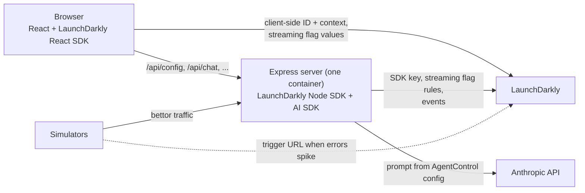

# Kickoff Sportsbook: a LaunchDarkly demo

<!-- Alec: in your words. 2 to 3 sentences on the story and why it matters to a VP of Engineering. -->
A fictional sportsbook is launching **live betting** right before the Super Bowl, and it can't afford a game-day outage. This sample app shows how LaunchDarkly lets the team ship the feature dark, test it in production with QA, release it by state, roll it back instantly (automatically when errors spike), and prove what works with experiments.

Stack: React (LaunchDarkly React SDK) + Node/Express (LaunchDarkly Node server SDK and AI SDK), packaged as one Docker container.

## What's in the demo

| Prompt requirement | LaunchDarkly feature | Where it lives | How to see it |
|---|---|---|---|
| **Part 1:** flag a new feature, release and roll back | Flag `live-betting` | `client/src/App.jsx` (`useBoolVariation`), `server/src/index.js` (`/api/live/odds`) | Toggle `live-betting` and watch the LIVE panel appear and disappear |
| **Part 1:** test in production before release | Individual target (`qa-tester`) | LaunchDarkly targeting | Only the QA persona sees live betting while customers don't |
| **Part 1:** instant switch with no page reload | Streaming + explicit listener | `client/src/App.jsx` (`ldClient.on("change:live-betting")`) | A toast appears the moment the flag changes |
| **Part 1:** remediate with a trigger | Flag trigger (turn off) | `make fire-trigger`, `simulator/index.js` | Fire it with curl, or let `make simulate-outage` fire it when errors spike |
| **Part 2:** flag a landing page component | Flag `new-bet-slip` | `client/src/BetSlip.jsx` | Classic slip vs new slip (quick stakes, payout preview) |
| **Part 2:** context with custom attributes | User contexts | `server/personas.js`, `client/src/main.jsx` | `state`, `tier`, `accountAgeDays`, `isInternal` (`name` is private) |
| **Part 2:** individual and rule-based targeting | Target + rule | LaunchDarkly targeting on `new-bet-slip` | Switch personas: QA and NJ/NV get the new slip, CA gets the classic one |
| **Extra credit:** experiment on the Part 2 flag | Metric `bet-placed`, experiment | `client/src/App.jsx` (`track`), `server/src/index.js` (`/api/bets`), `simulator/bets.js` | `make simulate-bets`, then read the experiment results |
| **Extra credit:** AI Configs | AgentControl config `bet-assistant` | `server/src/chat.js`, `client/src/ChatWidget.jsx` | Ask the bet assistant; change the prompt in LaunchDarkly with no deploy |
| **Extra credit:** integrations | GitHub code references, Slack | `.github/workflows/ld-code-refs.yml` | Flag pages show code references; Slack posts flag changes |

## Prerequisites and assumptions

- **Docker** with Docker Compose v2 (Docker Desktop on macOS or Windows, or Docker Engine on Linux). This is the only runtime you need: the app, scripts, and simulators all run in containers.
- **make** and **git** (preinstalled on macOS and most Linux distributions; on Windows, use WSL 2).
- A **LaunchDarkly account**. A free trial works. Guarded rollouts and some features need paid plans; nothing below requires them.
- Optional: an **Anthropic API key** for the bet assistant chatbot. Without it, the chatbot says it isn't set up and everything else works.
- Optional: **Node.js 24** if you want the hot-reload dev loop (`make dev`). The repo pins it in `.node-version`.
- Ports **3000** (app) and, for `make dev`, **5173** must be free.
- The demo uses the **Production** environment of one LaunchDarkly project (see [Environments](#environments)).

## Setup

### 1. Clone and create your `.env`

```bash
git clone https://github.com/alecs396/ld-sportsbook-demo.git
cd ld-sportsbook-demo
cp .env.example .env
```

`.env` is gitignored. `.env.example` explains every variable.

### 2. Create a LaunchDarkly API access token

In LaunchDarkly: **gear icon > Authorization > Create token**, role **Writer**. Copy it (it's shown once) into `.env` as `LD_API_TOKEN`.

### 3. Create the LaunchDarkly resources

```bash
make bootstrap
```

This uses only the API token to create the project `ld-sportsbook-demo` (set `LD_PROJECT_KEY` in `.env` to use another key), both flags, the metric, the AgentControl config, and the trigger, then sets the demo's starting targeting. The trigger's secret URL is saved to `LD_TRIGGER_URL` in `.env` without being printed. It's safe to run again: anything that exists is skipped.

Prefer to click through it yourself, or want to see exactly what it creates? See [LaunchDarkly resources](#launchdarkly-resources).

### 4. Add the SDK key and client-side ID

In LaunchDarkly: **gear icon > Organization settings > SDK keys**, choose your project and **Production**, and copy:

- the **SDK key** (starts with `sdk-`, secret, server only) into `LD_SDK_KEY`
- the **client-side ID** (public, used by the browser) into `LD_CLIENT_SIDE_ID`

Optional: add `ANTHROPIC_API_KEY` for the bet assistant.

### 5. Check everything and start the app

```bash
make doctor
make up
```

`make doctor` checks your keys, token, and every LaunchDarkly resource, and tells you what to fix. Then open:

- **Sportsbook:** http://localhost:3000
- **Presenter panel:** http://localhost:3000/presenter (one-click personas and live flag values with evaluation reasons)

`make down` stops it and `make logs` follows the logs.

## Running the demo

Open the sportsbook and the presenter panel side by side. Run `make demo-reset` before each run-through to restore the starting state.

### Part 1: release and remediate (`live-betting`)

1. **Ship dark.** `live-betting` targeting is off: everyone sees "Live betting is coming soon."
2. **Test in production.** Turn targeting **on**. `qa-tester` (Peter) is individually targeted, so only QA sees the LIVE panel. Customers still see the teaser.
3. **Release.** Change the default rule to serve **true**. Every customer's page switches to the LIVE panel with no reload, and a toast from the explicit change listener announces it.
4. **Roll back.** Turn targeting **off**. The panel disappears for everyone, instantly, with no deploy.
5. **Remediate with the trigger.** With live betting on, fire the trigger:

   ```bash
   make fire-trigger
   ```

   or with curl directly (reads the secret URL from `.env` without printing it):

   ```bash
   curl -X POST -H "Content-Type: application/json" -d '{"eventName":"Manual remediation"}' "$(grep '^LD_TRIGGER_URL=' .env | cut -d= -f2-)"
   ```

6. **Automatic remediation.** Release live betting to everyone again, then run:

   ```bash
   make simulate-outage
   ```

   Simulated bettors hit the live odds API while a demo "bug" makes it fail. The simulator acts as a monitoring tool: when the error rate crosses 20%, it fires the trigger, the flag turns off, and the errors stop. Press Ctrl+C to stop (outage mode turns off automatically).

### Part 2: targeting (`new-bet-slip`)

Switch personas with the dropdown in the header or the presenter panel. Each switch calls `identify()`, so flags re-evaluate with no reload.

| Persona | Context | Bet slip | Why |
|---|---|---|---|
| Peter | NV, vip, internal QA | New | Individual target (`qa-tester`) |
| Cody | NJ, standard | New | Rule "Legal live-betting states" (`state` is one of NJ, NV) |
| Maya | NV, vip | New | Same rule |
| Sam | CA, standard | Classic | No match, default rule |

The presenter panel shows the evaluation reason for each value (Individual target, Rule 1, Default rule).

### Extra credit: experiment

The experiment "New bet slip vs classic" runs on the **Legal live-betting states** rule of `new-bet-slip`, with the `bet-placed` metric. Both slips send `track("bet-placed")` from the same function, so only the design differs.

1. Create the experiment in LaunchDarkly (**Create > Experiment**): flag `new-bet-slip`, rule "Legal live-betting states", metric `bet-placed`, randomize by `user`, 50/50 with Classic slip as control. Start an iteration.
2. Generate traffic:

   ```bash
   make simulate-bets
   ```

   500 simulated bettors see a slip (the exposure) and some place a bet (the conversion).
3. Read the results in the experiment's **Results** tab.

> **The experiment data is simulated.** The simulator converts bettors at 25% on the classic slip and 40% on the new slip, so the experiment has a clear result to find. It demonstrates the setup (exposures and conversions joined by stable context keys, analyzed by LaunchDarkly), not real customer behavior. In my run: classic 25.8% vs new 43.5%, a 68% relative lift, statistically significant.

### Extra credit: AI Configs (bet assistant)

Click **Ask the bet assistant** (bottom left). The server gets the `bet-assistant` AgentControl config for the current persona: the model (Claude Haiku 4.5), parameters, and system prompt, which includes the bettor's state from their context (`{{ ldctx.state }}`). It then calls Claude and records duration, tokens, success, and thumbs up/down feedback against the variation that answered.

- **Change behavior with no deploy:** edit a variation's prompt in LaunchDarkly and ask again.
- **Compare variations:** the default rule splits 50/50 between "Concise explainer" and "Friendly coach". Run `make simulate-chat` (20 chats with SIMULATED feedback, about $0.03, capped at 50) and open the config's **Monitoring** tab.
- **Kill switch:** turn the config's targeting off and the assistant replies that it's unavailable.

### Extra credit: integrations

- **GitHub code references:** `.github/workflows/ld-code-refs.yml` scans every push and shows, on each flag's **Code references** tab, where the flag is used. To enable it in your fork, add a repository secret `LD_ACCESS_TOKEN` (an API token that can write code references) and, if your project key isn't `ld-sportsbook-demo`, a repository variable `LD_PROJECT_KEY`.
- **Slack:** install the LaunchDarkly Slack app, run `/launchdarkly account` to connect, then `/launchdarkly subscribe -p ld-sportsbook-demo -e production` in a channel. Flag changes, including trigger-driven rollbacks, are posted there.

## LaunchDarkly resources

`make bootstrap` creates all of these. To create them by hand, match the keys exactly: the code references them by key, and a missing or misspelled one falls back to its default value silently.

| Key | Type | Settings |
|---|---|---|
| `live-betting` | Boolean flag | Variations "Available" (true) / "Unavailable" (false). Available to client-side SDKs. Default on and off: false. Individual target `qa-tester` gets true. Turn-off trigger (generic). Starting state: targeting off. |
| `new-bet-slip` | Boolean flag | Variations "New slip" (true) / "Classic slip" (false). Available to client-side SDKs. Individual target `qa-tester` gets true. Rule "Legal live-betting states": `state` is one of `NJ`, `NV` serves true. Default rule: false. Targeting on. |
| `bet-placed` | Metric | Custom conversion (Occurrence), event key `bet-placed`, higher is better, randomized by `user`. |
| `bet-assistant` | AgentControl config | Completion mode. Variations "Concise explainer" and "Friendly coach", model Claude Haiku 4.5, `max_tokens` 300, system prompts in `scripts/bootstrap.js`. Default rule 50/50. |
| Trigger on `live-betting` | Flag trigger | Generic trigger, action "Turn off flag". Its URL goes in `LD_TRIGGER_URL`. |

Flag keys in code carry a `// FLAG:` comment, and the SDK key location carries a `// SDK KEY:` comment.

## Make commands

| Command | What it does |
|---|---|
| `make up` / `make down` / `make logs` | Build and run the app in Docker, stop it, follow logs |
| `make dev` | Hot-reload dev loop (needs Node 24): Vite on :5173, API on :3000 |
| `make bootstrap` | Create all LaunchDarkly resources from `LD_API_TOKEN` |
| `make doctor` | Pre-flight check: env vars, keys, SDK, resources, demo state, app |
| `make demo-reset` | Restore the demo's starting state (safe to run repeatedly) |
| `make fire-trigger` | Fire the `live-betting` turn-off trigger |
| `make simulate` | Simulated bettor traffic on the live odds API |
| `make simulate-outage` | Same, with the demo bug on; fires the trigger when errors spike |
| `make simulate-bets` | Experiment traffic for `new-bet-slip` |
| `make simulate-chat` | Bet assistant traffic with simulated feedback (calls Claude) |

Scripts and simulators run with local Node when it's installed, and inside the app image otherwise. Force the Docker path with `DOCKER=1`, for example `make doctor DOCKER=1`.

## Architecture



- **Two SDKs, two key types.** The server SDK uses the secret **SDK key**, downloads the flag rules, and evaluates locally. The browser uses the public **client-side ID**: LaunchDarkly evaluates for the browser's one context and returns only the values, never the rules.
- **Runtime config.** The browser gets the client-side ID from `/api/config` at startup instead of it being baked into the build, so the same image runs anywhere.
- **LaunchDarkly isn't in the request path.** If it's unreachable, the server keeps its last known rules or serves fallback values, and the page still renders.

## Environments

The demo runs entirely in the project's **Production** environment. Flags are defined once per project, while targeting, individual targets, and SDK keys are per environment, so a real rollout would use Dev, Staging, and Production and promote tested configuration between them. Here, one environment keeps the demo focused: the Part 1 story is "test in production" with a QA target, and the experiment's data stays in one place. The scripts read `LD_ENVIRONMENT` (default `production`), so they work against any environment.

<!-- Alec: in your words. Why you made this choice. -->

## Security notes

- `.env` is gitignored, and the Docker image never contains it; keys are injected at runtime.
- The SDK key, API token, trigger URL, and Anthropic key are secrets. The client-side ID is the only key that reaches the browser.
- `/api/demo/outage` is an unauthenticated demo endpoint. Don't expose it on a public deployment.

## Troubleshooting

Run `make doctor` first; it pinpoints most problems.

- **Flags always false:** the key is from the wrong environment or project, or the flag isn't available to client-side SDKs. `make doctor` checks both.
- **"LaunchDarkly client-side ID is missing":** set `LD_CLIENT_SIDE_ID` in `.env` and restart.
- **Bet assistant unavailable:** check `ANTHROPIC_API_KEY` and that the `bet-assistant` config's targeting is on.
- **Port already in use:** stop `make dev` or other apps on 3000/5173, or run `make down`.

## What I learned

<!-- Alec: in your words. 3 to 5 takeaways, e.g. from your learning log. -->
